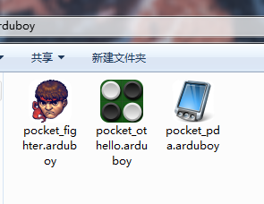
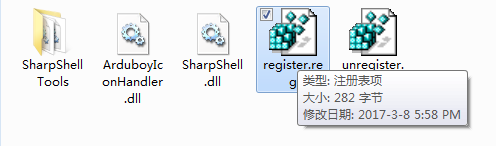
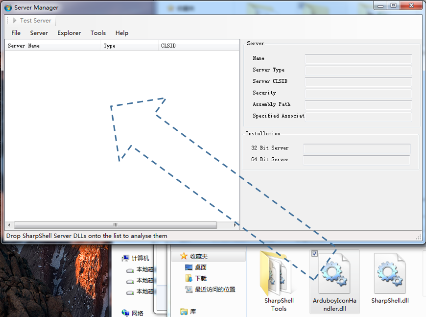
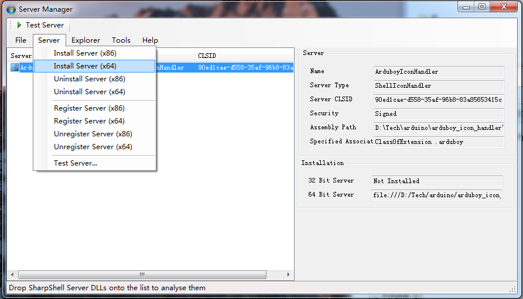
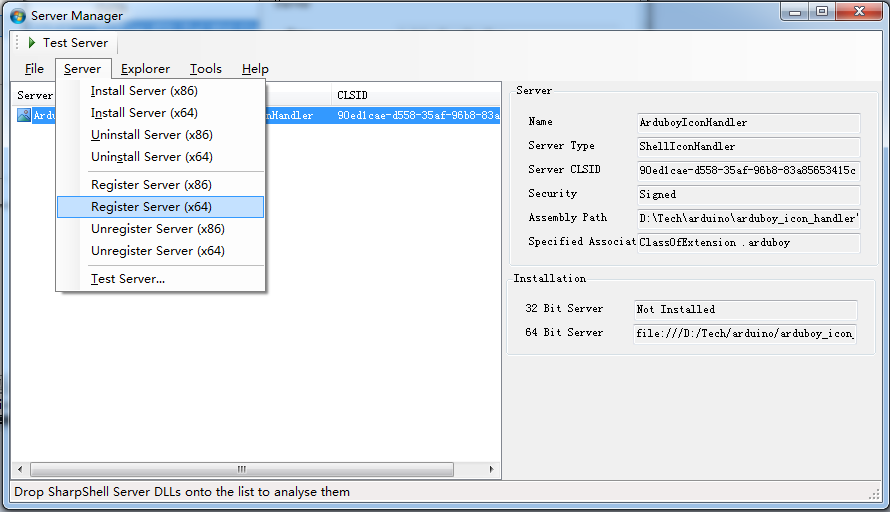
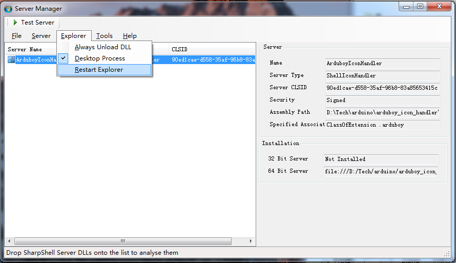
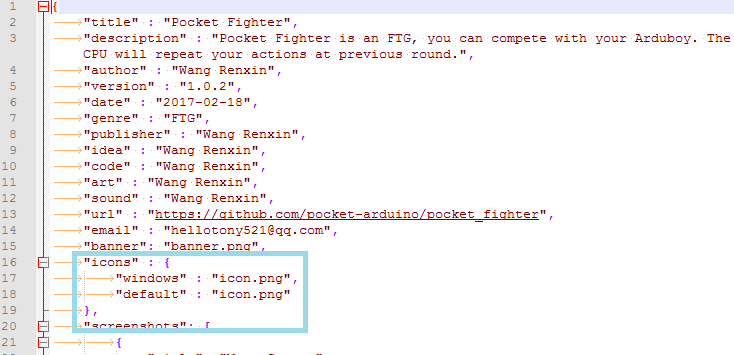

# Arduboy Icon Handler

**Created by [Wang Renxin](https://github.com/paladin-t).**

I created this project based on Dave Kerr's [.NET Shell Extensions - Shell Icon Handlers](https://www.codeproject.com/Articles/522665/NET-Shell-Extensions-Shell-Icon-Handlers).

Arduboy Icon Handler itself is distributed under [DO WHAT THE FUCK YOU WANT TO PUBLIC LICENSE](http://sam.zoy.org/wtfpl/COPYING).

## Introduction

Arduboy Icon Handler is a system shell extension, which helps to present particular icons of .arduboy files.

I've already updated all my Arduboy files with icons.

It supports Windows only for the moment. And uses a COM server technology.

## Installation

Everything required to use it is in the `/bin` directory. Please put them at a proper location as you wish on your hard drive before installation.

Double click the `/bin/register.reg` to import necessary information to the system registry.

Execute the `bin/SharpShell Tools/ServerManager.exe` to run the COM server manipulation tool.

Drag the `/bin/ArduboyIconHandler.dll` onto the server tool window.

Click the menu `Server`, `Install Server (x86/x64)` according to your platform.

Click the menu `Server`, `Register Server (x86/x64)` according to your platform.

Click the menu `Explorer`, `Restart Explorer` to let the explorer loads and uses the COM assembly.

Sometimes Windows may not rebuild the icon cache immediately, if the icon is not affected, please try restarting your computer, or use some tool to rebuild the icon cache.

## Uninstallation

Click the menu `Server`, `Unregister Server (x86/x64)` according to your platform.

Click the menu `Server`, `Uninstall Server (x86/x64)` according to your platform.

Double click the `/bin/unregister.reg` to remove imported registry data.

## For developers

It's simple to add an icon to your .arduboy file.

1. Edit the `info.json` file of the .arduboy package, by adding a `"icons"` section, see follow image for instance.
2. Pack an icon file into the .arduboy package.

The Arduboy Icon Handler will follow some steps to determine how to show an icon.

1. Tries to use `.arduboy/info.json/icons/windows`.
2. Tries to use `.arduboy/info.json/icons/default`.
3. Tries to use `.arduboy/icon.ico`.
4. Tries to use `.arduboy/icon.png`.
5. Uses the default Arduino icon.

It will use the first available one.
